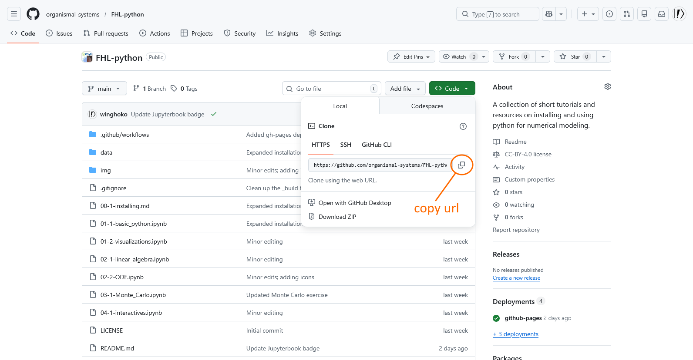
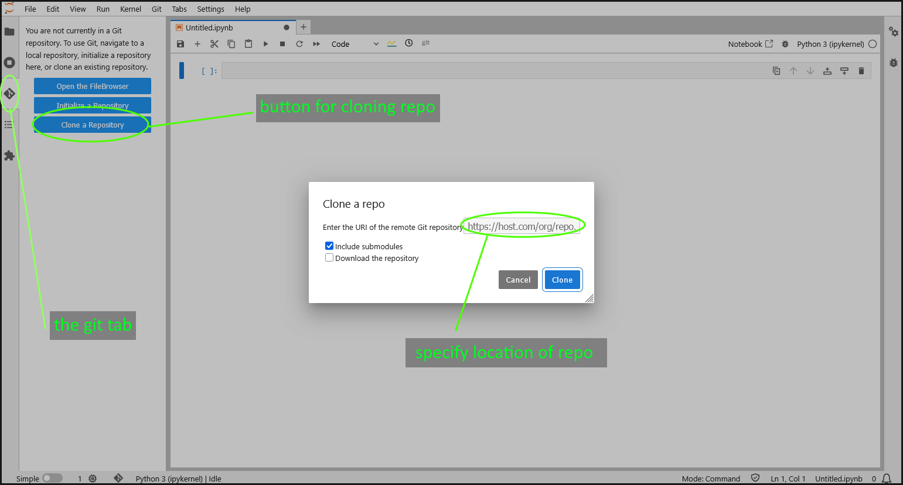
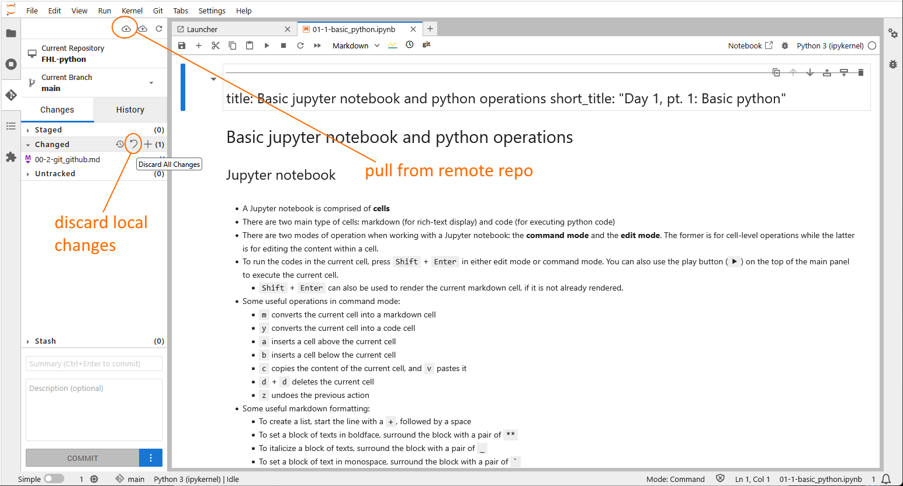

The executable models used this workshop are all published on GitHub. The most convenient way to download these models to your local computer is through the use of the Git software. Below we provide some information about both Git and GitHub and describe their basic uses.

## What is Git? What is GitHub?

Git is an open-sourced version control software. It keeps track of changes to your files within specific location(s) on your local storage. With git you can efficiently save snapshots of your work at different times, and roll back to a specific version as needed. It also provides utilities to sync your changes to files with an online service. To use Git you install it on your local computer.

GitHub is a free online service owned by Microsoft that lets you store your Git repositories in the cloud, and to (optionally) make them available to collaborators and/or the general public. It works with Git but also provides a web-based interface.

## Installing Git

To install Git, [download the software](https://git-scm.com/install/) for your OS and follow the installation instructions. Once installed, Git should be available from the command line (e.g., cmd.exe on Windows and Terminal on macOS). Optionally, you may also want to install [GitHub Desktop](https://desktop.github.com/download/) to make your integration with GitHub easier.

## Using Git

The most basic use of Git is to clone an existing repository from Github (the "cloud") to your local computer. As an example let's consider cloning the [FHL-python](https://github.com/organismal-systems/FHL-python) repo for which this page is a part of.

The first step is to find the git url associated with the repo. To do so, open the github page from the above link and click on the "`<> code`" button on the top right (see figure below). This will bring up a menu from which you can copy the HTTPS url. On the command line application on your local computer, navigate to the folder you want to place the repo in, and execute:

```
    git clone <url_to_the_repo>
```

Git will then do the work and create a subfolder containing the repo.



**Figure 1**: GitHub webpage from which the git clone url can be found.

When you do work on the local repo, the contents between your local repo and the repo on GitHub will become out of sync. The same can happen if the GitHub repo is updated. To sync your local repo **to** the GitHub version (**note**: this will wipe the work you have done locally), change directory to **inside** the local repo, then execute:

```
    git restore .
    git pull origin
```

Which will sync your repo with the latest version on GitHub.

## Using the jupyterlab-git extension

An alternative to using the command line is to use the `jupyterlab-git` extension. Note however that you **still need to install git** on top of having the extension installed.

If you create the `osym` environment following the instructions from the previous section the extension should already be installed and activated for you. What the extension does is to add a "git" pane on the left icon menu of Jupyter Lab. When you click on the icon from outside a git repo, the left pane will show buttons for cloning existing repo. When you click on the button, a dialog will open where you can paste the url of the remote repo and start cloning.



**Figure 2**: Jupyter Lab page with the git pane activated and the cloning button clicked.

In addition, when you open the "git" pane from **within** a git repo, you will find thatit provides information on which file(s) have been modified, and to roll back the changes if needed. It also allows you to refresh the remote repo and check if anything has changed, as well as a "cloud download" button that lets you pull from the remote repository. See figure below.



**Figure 3**: Jupyter Lab page with the git pane activated and the git pull option highlighted.

## Further Git functionalities

In addition to cloning existing repo, you can also create your own repo and post them on Github. Some good resources for learning these functions of Git and GitHub can be found on [RealPython](https://realpython.com/python-git-github-intro/) and [HubSpot](https://product.hubspot.com/blog/git-and-github-tutorial-for-beginners).
